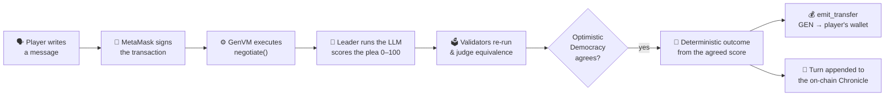

<div align="center">

# 🐉 Negotiate with the Dragon

### An AI‑judged, fully on‑chain game powered by **GenLayer Intelligent Contracts**

*An ancient dragon guards a hoard of real **GEN** tokens. Talk it out of its gold — flatter it, bargain with it, threaten it — and an **LLM living inside the smart contract** decides, on‑chain, whether you walk away rich or end up as ash.*

[](https://negotiate-with-the-dragon.vercel.app)

[](https://genlayer.com)
[-5ad17a?style=flat-square)](https://explorer-bradbury.genlayer.com/)
[](#-the-frontend--studio-grade-presentation)
[](#-the-intelligent-contract-deep-dive)

</div>

---

## 🟢 Live deployment

| | |
| --- | --- |
| **🎮 Play now** | **https://negotiate-with-the-dragon.vercel.app** |
| **📜 Intelligent Contract** | [`0xCA98d7142c8bB468D9891a773602106C11692526`](https://explorer-bradbury.genlayer.com/address/0xCA98d7142c8bB468D9891a773602106C11692526) (view on the Bradbury explorer) |
| **🌐 Network** | GenLayer **Bradbury** Testnet (chain id `4221`) — RPC `https://rpc-bradbury.genlayer.com` |
| **💰 The hoard** | A live treasury of **GEN**, payable to anyone who wins |
| **🤝 Consensus** | Optimistic Democracy — validators agree on the AI's verdict |

> Connect MetaMask to the GenLayer testnet, **enter the lair**, and start talking.

---

## ✨ What is this?

**Negotiate with the Dragon** is a single‑page game where *the rules are enforced by an AI that runs inside a blockchain smart contract.* There are no buttons that "win" for you, no hidden RNG, no off‑chain server deciding outcomes. You write a sentence in plain English; a Large Language Model — **executed deterministically‑enough to reach consensus inside the GenVM** — reads it in character as the dragon, scores your argument from 0–100, and the contract pays out **real GEN** if you were convincing enough.

Every verdict is reproduced and agreed upon by multiple validators. The dragon *remembers* your previous turns, its mood shifts, its patience drains — and when that patience hits zero, you are **incinerated and locked out forever**. One wallet, one life, one negotiation.

This is something you genuinely **cannot build on a traditional blockchain.** And that is exactly why GenLayer is so exciting.

---

## 🌐 Why GenLayer makes this possible

Traditional smart‑contract platforms (Ethereum, Solana, …) are brilliant at deterministic math, but they are **blind and deaf**: a contract cannot read natural language, cannot reason about intent, and cannot call an AI model — because every validator must compute the *exact same* result, and AI outputs are non‑deterministic.

**GenLayer solves this head‑on, and it's a genuine leap forward.** GenLayer is the first **Intelligent Contract** platform: a blockchain whose virtual machine (the **GenVM**) treats Large Language Models and live web access as **first‑class, on‑chain primitives**, while still reaching trustless consensus. It does this with two beautiful ideas:

- **🧠 Native non‑determinism.** A contract can call `gl.nondet.exec_prompt(...)` and get an LLM's judgment *during execution*. The GenVM sandboxes and records these calls so they can be re‑examined by the network.
- **🗳️ Optimistic Democracy.** Instead of demanding bit‑identical outputs, GenLayer's consensus asks validators to **agree that two AI results are equivalent** under a developer‑defined *equivalence principle*. A leader proposes an outcome; validators re‑run the reasoning and vote on whether it's acceptable. This is what makes "did this argument convince the dragon?" a *consensus‑safe* question.

The result: GenLayer lets you put **subjective, language‑based, AI‑driven logic on‑chain** — with the same finality and verifiability you'd expect from any smart contract. Insurance claims, content moderation, prediction markets, autonomous agents, and yes — a dragon that argues back — all become possible. This project is a love letter to that capability: it takes the *single hardest thing* to do on a blockchain (have an AI fairly judge free‑form human text and move money based on it) and shows GenLayer doing it **elegantly, in ~200 lines of Python.**

> 🙌 Huge respect to the GenLayer team — the developer experience (Python contracts, `genlayer-js`, the GenVM tooling) makes building this kind of AI‑native dApp genuinely delightful.

---

## 🧩 How a turn works, end to end



1. **You speak.** The frontend sends your sentence to the contract's `negotiate(message)` method via `genlayer-js`; MetaMask signs it.
2. **The dragon thinks.** Inside the GenVM, the leader validator builds a rich prompt (the dragon's name, personality, secret weakness, current mood, anger, and your conversation history) and calls the on‑chain LLM, which returns a JSON verdict: `score`, `mood`, and an in‑character `reply`.
3. **The network agrees.** Other validators **re‑run the judgment** and accept the leader's result only if their independent score lands in the **same outcome band within ±15 points** — our equivalence rule. This is Optimistic Democracy in action.
4. **The world updates — deterministically.** From the *agreed* score, the contract resolves the turn with pure arithmetic: payout, patience loss, wrath gain, streaks, criticals, victory or incineration.
5. **The gold moves.** If you won, the contract performs a **native GEN transfer** straight to your wallet, and the turn is permanently recorded in the on‑chain Chronicle.

---

## 🧠 The Intelligent Contract (deep dive)

The entire game logic lives in [`contracts/dragon_escrow.py`](contracts/dragon_escrow.py) — a single GenLayer Intelligent Contract written in Python.

### Persistent, typed on‑chain storage

GenLayer gives contracts strongly‑typed persistent storage that feels like normal Python:

```python
class DragonEscrow(gl.Contract):
    dragon:    TreeMap[str, str]        # name, personality, secret weakness, mood
    anger:     u256                     # global wrath
    patience:  TreeMap[Address, u256]   # per-player patience
    burned:    TreeMap[Address, bool]   # incinerated players (locked out forever)
    gold_won:  TreeMap[Address, u256]   # leaderboard ledger
    streak:    TreeMap[Address, u256]   # consecutive successes
    history:   DynArray[str]            # the Chronicle (JSON turn entries)
```

### The AI verdict + consensus

The heart of the contract: a **leader** runs the LLM; a **validator** re‑runs it and votes on equivalence. GenLayer wraps both in a single consensus‑safe call:

```python
def leader_fn() -> dict:
    raw = gl.nondet.exec_prompt(prompt, response_format="json")
    return parse_verdict(raw)          # defensive JSON parsing + key aliasing

def validator_fn(leaders_res) -> bool:
    mine = leader_fn()                 # independent re-evaluation
    # accept only if same outcome band AND within ±15 points
    return _outcome_band(leader.score) == _outcome_band(mine["score"]) \
        and abs(leader.score - mine["score"]) <= SCORE_TOLERANCE

verdict = gl.vm.run_nondet_unsafe(leader_fn, validator_fn)
```

This is the **equivalence principle** pattern recommended by GenLayer's official `write-contract` guidance: we don't require the two LLM runs to be identical (they never will be) — we require them to *agree on what happened*.

### Moving real value

When you win, the contract pays you in native GEN using the GenVM's contract‑to‑account transfer primitive:

```python
gl.get_contract_at(player).emit_transfer(value=u256(payout), on="finalized")
```

The hoard itself is the contract's own balance, topped up through a `@gl.public.write.payable` `fund_treasury()` method — real tokens, escrowed on‑chain, released only by the AI's verdict.

---

## 🎮 Game mechanics

The dragon's reply maps to one of five **outcome bands**, applied deterministically from the consensual score:

| Band | Score | What happens |
| --- | --- | --- |
| 🌟 **Legendary** | ≥ 95 | A massive **35%** of the hoard, plus a critical flourish |
| ✅ **Success** | 70–94 | **10–25%** payout, boosted by your win streak |
| 😐 **Neutral** | 40–69 | No gold; patience −8 |
| ❌ **Failure** | 11–39 | Patience −15 and the dragon's wrath stings harder |
| 💥 **Catastrophic** | ≤ 10 | Brutal patience loss — you may be incinerated on the spot |

- **🔥 Patience & Wrath** — every player has a patience meter; the dragon has global wrath. Anger makes failures hurt more.
- **⚡ Win streaks** — consecutive successes add **+2% payout each** (capped at +10%).
- **🏆 Victory** — a payout that would leave less than 1% of the original hoard surrenders *everything*: the dragon is talked out of its last coin.
- **☠️ Incineration** — when your patience reaches **0**, you are burned. That wallet is **locked out forever**. The dead do not negotiate.
- **📊 Leaderboard** — an on‑chain `get_leaderboard()` registry ranks every challenger by gold extracted; relive the best pleas in the **Hall of Legends**.

---

## 🎨 The frontend — studio‑grade presentation

A custom React + Vite + TypeScript client built to feel like a real game, not a dApp form:

- **Cinematic onboarding** — a chaptered intro that tells the legend, the rules, and the one‑life warning before you enter.
- **Living vector dragon** — rim‑lit by its own gold, a Smaug‑style **chest furnace** that surges while validators deliberate, cursor‑tracking eye, breathing, smoke, and fire‑breath reactions to your verdicts.
- **A breathing cavern** — volumetric fog, god rays, glowing crystals, lava cracks, parallax rock, ember particles, the odd bat, film grain and vignette.
- **Game feel** — physics gold‑coin bursts, screen shake on criticals, full‑screen fire/gold flashes, RPG floating combat text, and victory gold‑rain.
- **Procedural audio** (WebAudio, zero asset files) — cave ambience, gold chimes, growls, fire blasts, a victory fanfare, and a danger **heartbeat** when patience runs low.
- **Transparent on‑chain UX** — the full transaction lifecycle surfaced as toasts (*signing → pending → **ACCEPTED** → **FINALIZED***), a per‑wallet Chronicle, a wrath ring, a segmented patience bar, and graceful handling of RPC rate‑limits and slow LLM consensus.

---

## 🔌 genlayer-js integration

Reading state is free; writing is signed by the player's wallet:

```ts
import { createClient } from 'genlayer-js'
import { testnetBradbury } from 'genlayer-js/chains'
import { TransactionStatus } from 'genlayer-js/types'

const reader = createClient({ chain: testnetBradbury })                 // free views
const writer = createClient({ chain: testnetBradbury, account: addr })  // MetaMask signs

// Talk to the dragon
const hash = await writer.writeContract({
  address: CONTRACT_ADDRESS,
  functionName: 'negotiate',
  args: ['O wise Vermithrax, I offer you my library of elven scrolls…'],
  value: 0n,
})

// LLM + validator consensus can take a while — wait patiently
await writer.waitForTransactionReceipt({ hash, status: TransactionStatus.ACCEPTED })
```

All read paths (`get_dragon_state`, `get_player_state`, `get_history`, `get_leaderboard`) are plain `readContract` calls. See [`frontend/src/lib/genlayer.ts`](frontend/src/lib/genlayer.ts).

---

## 🛠️ Run it locally

```bash
# 1. Frontend
cd frontend
cp .env.example .env        # points at the live Bradbury contract (public values)
npm install
npm run dev                 # http://localhost:5173 → ENTER THE LAIR → connect MetaMask
```

You'll need **MetaMask** with the GenLayer testnet and a little testnet GEN for gas. That's it — the client is already wired to the deployed contract.

---

## 🚢 Deploy your own dragon

```bash
cd frontend
cp ../contracts/.env.example ../contracts/.env   # add YOUR testnet PRIVATE_KEY (never commit it)

node scripts/validate-code.mjs ../../contracts/dragon_escrow.py   # instant GenVM schema check
node scripts/deploy.mjs --fund 10                                 # deploy + fund + write .env
node scripts/smoke.mjs                                            # verify the read paths
```

Lint the contract with the official tooling: `pip install genvm-linter` then `genvm-lint check contracts/dragon_escrow.py`.

> 🔐 **The deployer private key lives only in `contracts/.env`, which is git‑ignored and was never committed.** Treat it as testnet‑only.

---

## 📚 GenVM field notes (verified live on Bradbury)

Hard‑won, practical facts for fellow GenLayer builders:

- **Pin the runner hash.** The header must be `# { "Depends": "py-genlayer:<hash>" }`. The `test` / `latest` aliases are rejected on public networks (deploys land as `FINISHED_WITH_ERROR`).
- **Imports.** `from genlayer import *` exposes everything (`Address`, `u256`, `TreeMap`, `DynArray`, …). `genlayer.types` and `gl.chain` are not part of the current GenVM surface.
- **Native transfers.** `gl.get_contract_at(addr).emit_transfer(value=u256(...), on="finalized")`.
- **Message context.** Use `gl.message.sender_address`.
- **Instant validation without deploying.** RPC `gen_getContractSchema` with base64 code — see [`frontend/scripts/validate-code.mjs`](frontend/scripts/validate-code.mjs).

---

## 🗂️ Project structure

```
negotiate_with_the_dragon/
├── contracts/
│   ├── dragon_escrow.py       # The Intelligent Contract (deployed)
│   ├── probe.py               # GenVM API discovery probe (dev tool)
│   └── .env.example           # PRIVATE_KEY template (real .env is git-ignored)
├── frontend/
│   ├── scripts/               # deploy · validate-code · smoke (GenLayer ops)
│   ├── .env.example           # public contract address + network
│   └── src/
│       ├── lib/               # genlayer.ts (chain integration) · audio.ts · fx.ts
│       ├── hooks/             # useDragonGame · useWallet · useTypewriter
│       └── components/        # DragonScene · CaveScene · Chronicle · IntroScreen · …
└── README.md
```

---

## 🧱 Tech stack

**On‑chain:** GenLayer Intelligent Contract (Python) · GenVM · on‑chain LLM via `gl.nondet.exec_prompt` · Optimistic Democracy consensus · native GEN escrow & transfers.

**Frontend:** React 18 · Vite · TypeScript · Framer Motion · genlayer-js · WebAudio (procedural) · SVG/Canvas — deployed on Vercel.

---

## 🙏 Built on GenLayer

This game is a celebration of what becomes possible when a blockchain can *think*. GenLayer's Intelligent Contracts turn "an AI fairly judges human language and moves real money" from a fantasy into a few lines of Python — and that opens the door to an entirely new class of decentralized applications.

**Learn more & start building:**
[genlayer.com](https://genlayer.com) ·
[Docs](https://docs.genlayer.com) ·
[genlayer-js](https://github.com/genlayerlabs/genlayer-js) ·
[GenLayer Skills](https://skills.genlayer.com/) ·
[Builders Portal](https://portal.genlayer.foundation/)

<div align="center">

*Now go on — the dragon is waiting, and it has all the time in the world. You do not.* 🐉🔥

</div>
